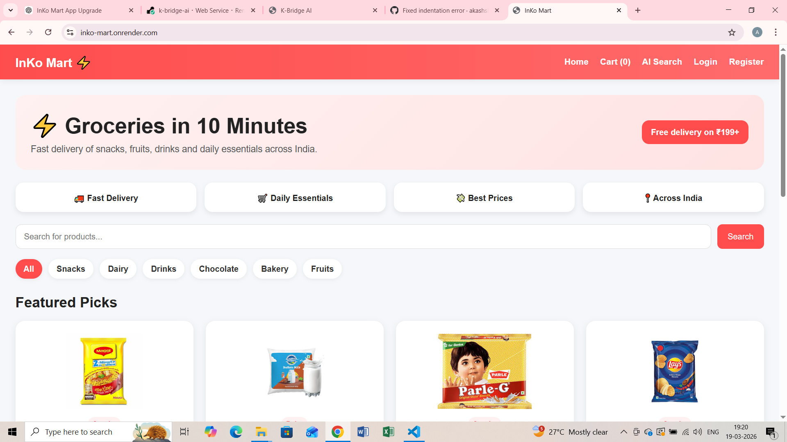
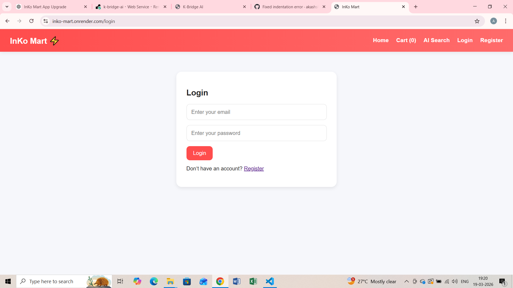
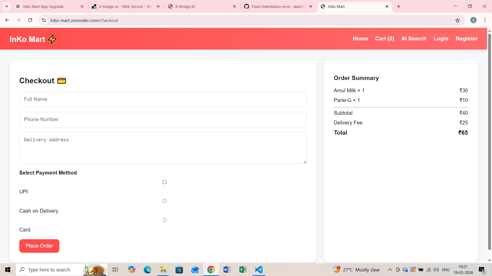
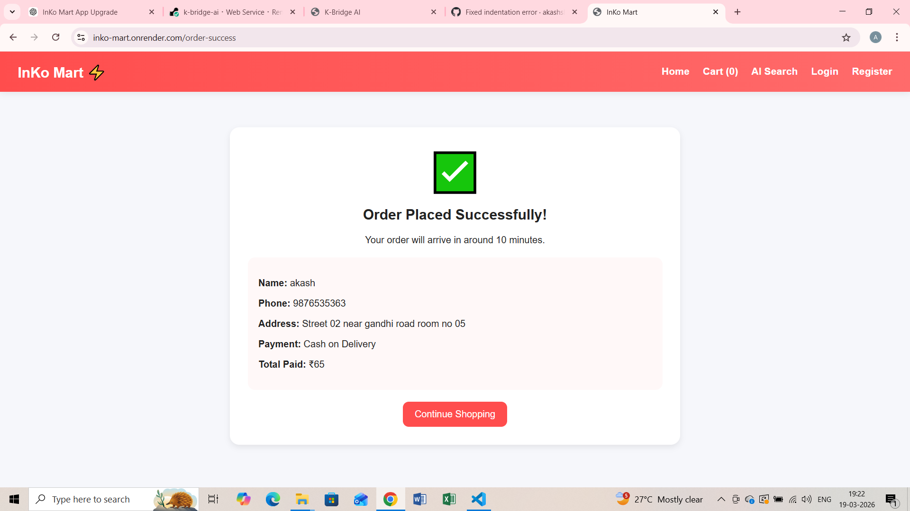

# 🛒 InKo Mart

10-Minute Delivery App for Indian Products 🇮🇳

## 🚀 Live Demo
(Add your Render link here)

---

## 💡 Features

- ⚡ Quick 10-minute delivery concept
- 🛍 Browse Indian grocery products
- 👤 User authentication (Login / Register)
- 🛒 Add to cart functionality
- 📦 Order placement system
- 🎨 Clean modern UI inspired by Blinkit / Zepto
- 🌐 Fully deployed web application

---

## 🛠 Tech Stack

- Python (Flask)
- HTML, CSS
- SQLite Database
- Flask-Login (Authentication)
- Deployed on Render

---

## 📸 Screenshots

### 🏠 Home Page

### 🔐 Login Page

### 📝 Checkout Page

### 📦 Order Page

---

## 🎯 Purpose

InKo Mart is designed as a **quick-commerce platform** inspired by Blinkit and Zepto, focusing on fast delivery of Indian products.

This project demonstrates:
- Full-stack web development
- User authentication system
- E-commerce flow (browse → cart → order)

---

## 📌 Future Improvements

- 💳 Payment integration (Razorpay)
- 📍 Real-time delivery tracking
- 📱 Mobile app version
- 🤖 AI-based product recommendations

---

## 💼 Project Value

This project showcases skills in:
- Backend development (Flask)
- Frontend UI design
- Database handling
- Deployment and production setup

---

Made with ❤️ by Akash